# Remote Lighting

A wireless dimmer system for LED lighting built from Arduinos and **nRF24L01 2.4 GHz radios**. A wall-mounted button **Controller**, built into a standard single-gang switch plate, sends commands to one or more **Receivers**. Each receiver drives up to three dimmable lighting zones with PWM.

Built in **2018** for under-cabinet kitchen lighting (the photos below are from then), and added to GitHub in April 2021.

| | |
|---|---|
| 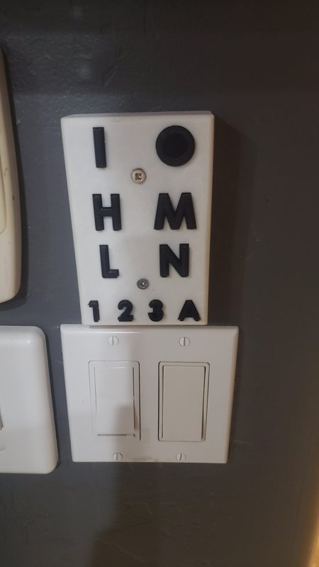 | 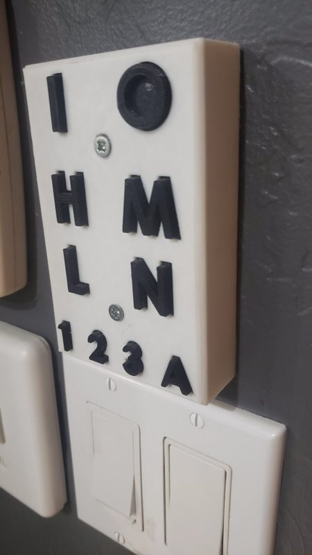 |
| The controller, mounted over its own wall box above the existing light switches | The raised letter buttons |

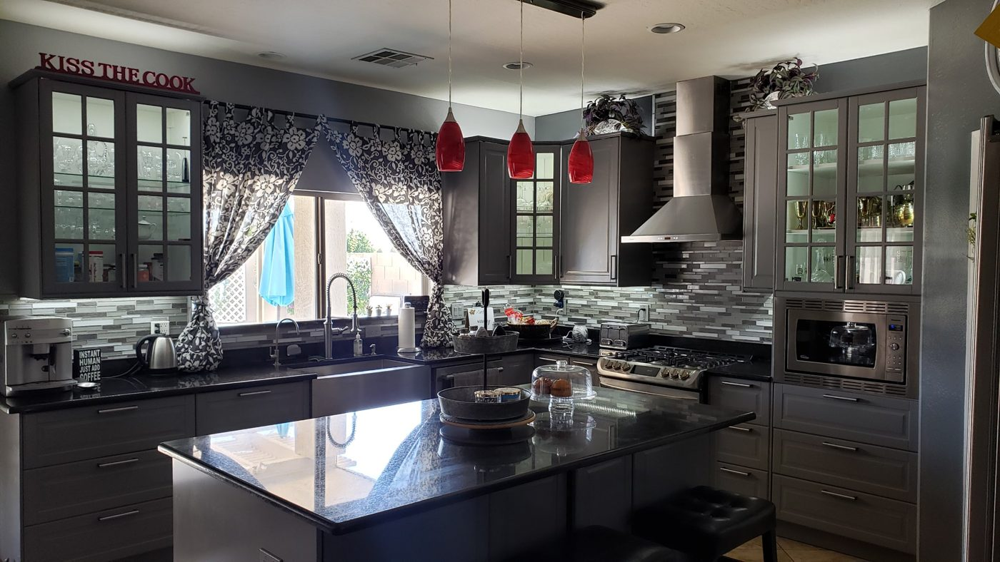

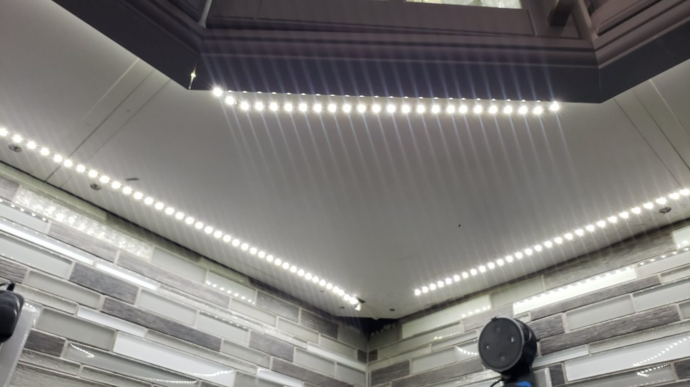

*The kitchen, and the LED strips under the cabinets that the system controls.*

## Features

- **On / Off** for the selected zones. Pressing *On* when already on turns all zones on, and pressing *Off* when already off turns all zones off.
- **Zones 1, 2, 3, or All**
- **Four brightness levels:** High, Medium, Low, and Night light
- Supports up to 4 receivers out of the box (more with a small config change)

## How it works

Every command is a single byte sent over the radio:

| Bits 7-6 | Bit 5 | Bits 4-2 | Bits 1-0 |
|---|---|---|---|
| unused | State: 1 = on, 0 = off | Zone: `001` = 1, `010` = 2, `100` = 3, `111` = all | Brightness: `11` High, `10` Med, `01` Low, `00` Night light |

Receivers map the brightness level to a PWM value (`5, 50, 150, 255`) on each selected zone's pin.

## Hardware

**Controller**
- Arduino (Uno/Nano-class) + nRF24L01 (CE pin 9, CSN pin 10, SPI)
- 10 buttons:

| Button | Pin |
|---|---|
| On | 7 |
| Off | 8 |
| High | A0 |
| Medium | A1 |
| Low | A2 |
| Night light | 6 |
| Zone 1 | 5 |
| Zone 2 | 4 |
| Zone 3 | 3 |
| All zones | 2 |

**Each receiver**
- Arduino + nRF24L01 (CE 9, CSN 10)
- Three MOSFETs on heatsinks driving the LED zones from PWM pins **3, 5 and 6** (zones 1-3)
- 12 V LED strip and a 12 V power supply

## Build

### Controller

| | | |
|---|---|---|
| 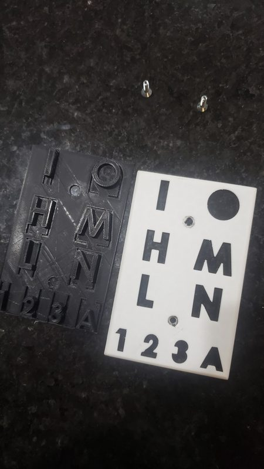 | 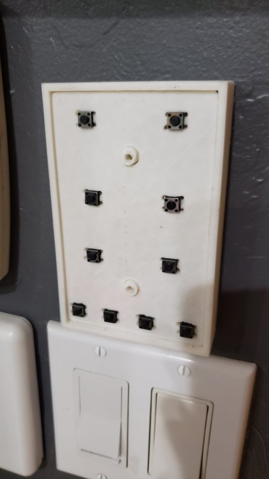 | 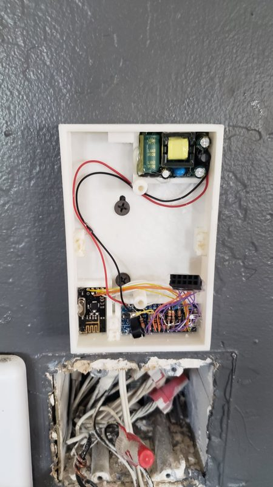 |
| The wall plate and the one-piece letter-button sheet that sits behind it | With the plate off: the 10 tactile switches the letters press | Inside: a small mains-to-DC power module (top), the nRF24L01 radio and the Arduino (bottom) |

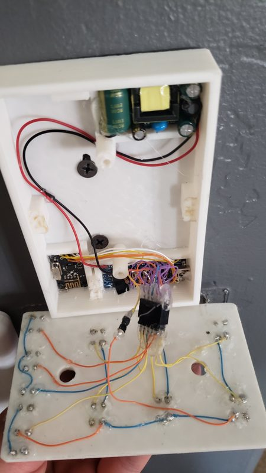

The switches are mounted on a printed board and hand-wired to a header that plugs into the Arduino. Behind the controller there's a standard electrical box in the wall, the same kind a normal light switch sits in. The controller mounts over it like a switch plate would, and the box brings mains power to the power module.

> **Mains voltage:** the controller's power module is wired to household mains. Turn the breaker off before working on it, and if you aren't comfortable with mains wiring, power the controller from a USB supply instead.

### Receiver

| | | |
|---|---|---|
| 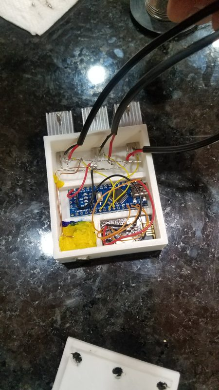 | 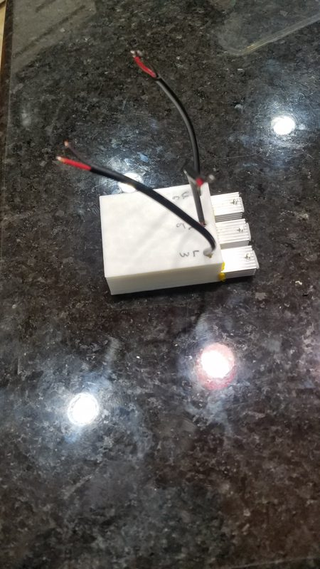 | 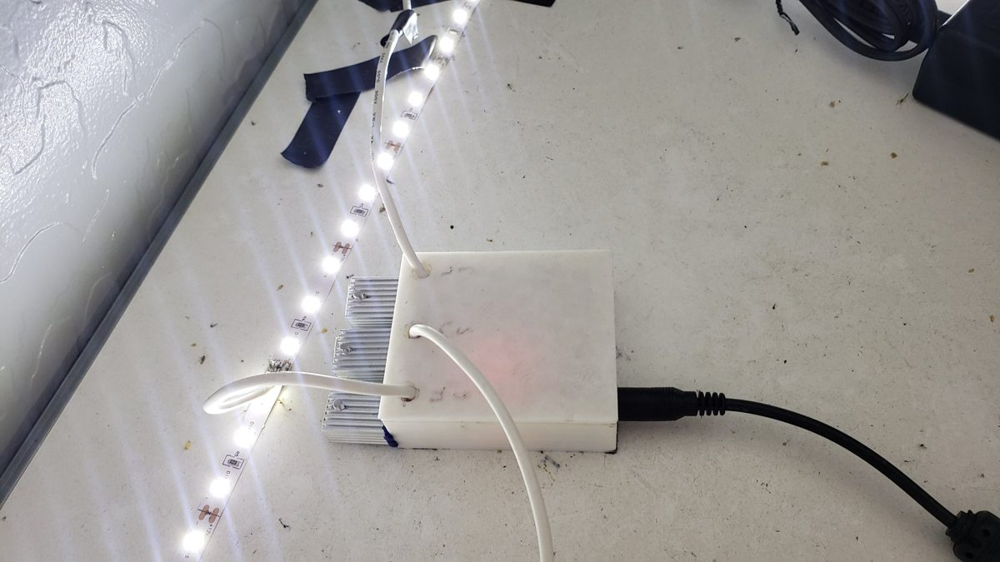 |
| An Arduino Nano and nRF24L01, with a MOSFET on a heatsink for each of the three zones | Closed up, with the zone outputs labelled | Installed out of sight, driving a 12 V LED strip from a 12 V supply |

## 3D-printed parts

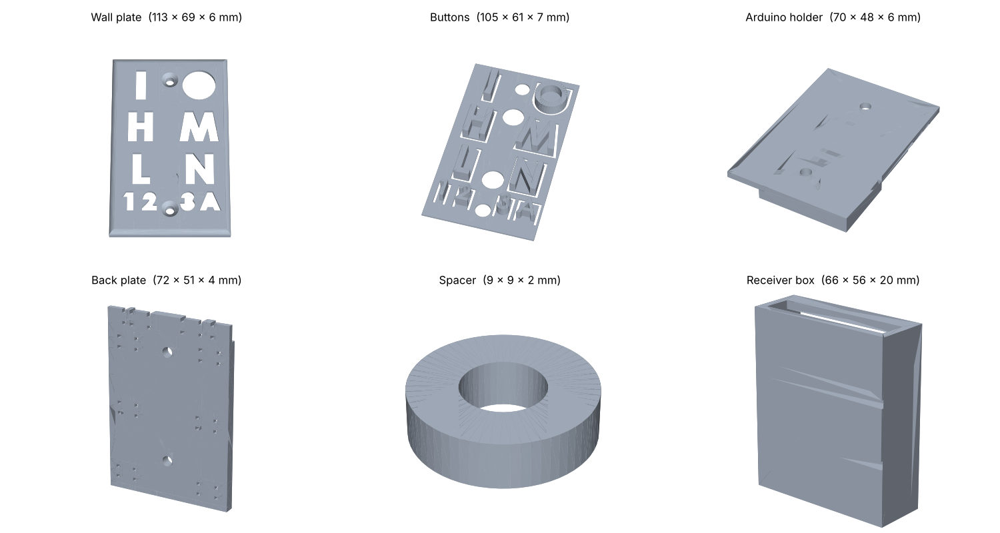

The STL files are in `models/`:

| File | Part |
|---|---|
| `Wall_Plate.STL` | Controller face plate. Standard single-gang switch-plate size (113 × 69 mm), with letter-shaped cut-outs: `I` / `O` (on/off), `H` `M` `L` `N` (high, medium, low, night light) and `1` `2` `3` `A` (zones) |
| `Buttons.STL` | The matching letter-shaped buttons, printed as one sheet that sits behind the wall plate |
| `Arduino_holder.STL` | Mount for the controller's Arduino |
| `Back_Plate.STL` | Controller back plate |
| `Spacer.STL` | Small round spacer (9 mm) |
| `Light_Receiver_-_Box.STL` | Enclosure for a receiver |

GitHub can show the STL files in 3D: open one there to rotate it.

## Setup

1. Install the [RF24 library](https://github.com/nRF24/RF24).
2. `Transmitter.h` holds the radio addresses. **Keep the copies in `Controller/` and `Receiver/` identical.**
3. Flash the **Controller** sketch once.
4. For **each receiver**, set `RECEIVER_NUMBER` in `Receiver/Transmitter.h` to a unique value, then flash it.
5. For more than 4 receivers, add addresses to `recieverAddress[]` and update `RECEIVER_COUNT`.

Both sides use radio channel 8 and low TX power. Change `radio.setChannel()` in both sketches if channel 8 is busy where you are.

## Files

| Path | Purpose |
|---|---|
| `Controller/Controller.ino` | Remote: reads buttons, sends commands |
| `Receiver/Receiver.ino` | Receiver: listens and sets zone brightness |
| `*/Transmitter.h` | Shared radio addresses and receiver count |
| `models/` | 3D-printable parts for the controller and receiver |
